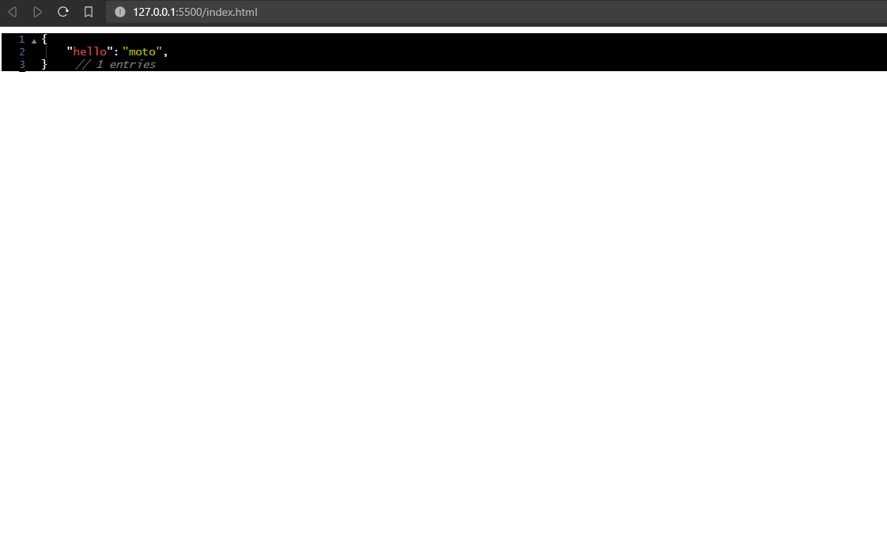

# jsontohtml-render

Convert JSON into HTML with ease using the "jsontohtml-render" npm package. This lightweight library allows you to transform JSON data into HTML tags and structures, making it simple to generate dynamic HTML to preview a json or any object in your JavaScript applications.

## Installation

You can install "jsontohtml-render" via npm:

```bash
npm install jsontohtml-render
```

or You can use it as in html:-

```html
<script src="https://cdn.jsdelivr.net/gh/ArjunVarshney/jsontohtml-render@latest/dist/index.js"></script>
```

## Table of contents

- [Features](#features)
- [Usage](#usage)
  - [Usage Example](#usage-examples)
- [Options](#options)
  - [Options Usage Example](#options-usage-examples)
  - [Option type definition](#type-declaration-of-the-options-property-of-type-jsontohtmloptiontype)
  - [Option default values](#default-values)
  - [Description of all the options available](#description-of-the-options)

## Features

- Render Javascript objects into an organized html
- Provides open and close functionality in the html
- Provides line numbers for the data
- Fully customizable

## Usage

### Usage Examples

- Convert Javascript objects to html :

```js
import { jsontohtml } from 'jsontohtml-render';
// const { jsontohtml } = require("jsontohtml-render");   //for CommonJS

console.log(jsontohtml({ hello: 'moto' }));
// <div .....
```

- Use it with react/next js:

```js
import { jsontohtml } from 'jsontohtml-render';

export default function Home() {
  // use it as show below
  const html = jsontohtml({
    hello: ['this', 'is', 'some', 'text'],
    arrayofobjects: [{ something: [1, 2, 3] }, {}],
  });

  return <div className="h-full w-full" dangerouslySetInnerHTML={{ __html: html }}></div>;
}
```

`Output of the code:`


- Use it in html

```html
<!DOCTYPE html>
<html lang="en">
  <head>
    <meta charset="UTF-8" />
    <meta name="viewport" content="width=device-width, initial-scale=1.0" />
    <title>Document</title>

    <!-- Add a script file -->
    <script src="https://cdn.jsdelivr.net/gh/ArjunVarshney/jsontohtml-render@latest/dist/index.js"></script>
    <!-- Add a script file as above -->
  </head>

  <body>
    <div id="json"></div>
    <script>
      // Use it to update html as follows
      document.getElementById('json').innerHTML = jsontohtml({ hello: 'moto' });
    </script>
  </body>
</html>
```

`Output of the code (using live server)`:


- Use it to print the result of an api request:

```js
'use client';

import axios from 'axios';
import { jsontohtml } from 'jsontohtml-render';
import { useEffect, useState } from 'react';

export default function Home() {
  const [html, setHtml] = useState('');

  const makeRequest = async (url: string) => {
    const result = await axios.get(url);

    // Set the html as follows
    setHtml(jsontohtml(result.data));
  };

  useEffect(() => {
    const url = 'https://body-works.vercel.app/api/equipments';
    makeRequest(url);
  }, []);

  return <div className="h-full w-full" dangerouslySetInnerHTML={{ __html: html }}></div>;
}
```

`Output of the code:`


## Options

The html preview of the object can be fully customized with the options property.

### Options usage examples

- For increasing the font size, you also need to change the spacing (for better formatting):

```js
jsontohtml(data, {
  fontSize: '25px',
  space: '40px',
  space_from_left: '80px',
  line_numbers: { space_from_left: '50px' },
  retractors: { space_from_left: '60px' },
});
```

- You can change visibility of any components:

```js
jsontohtml(data, {
  line_numbers: { show: false },

  // for better formatting
  space_from_left: '20px',
  retractors: { space_from_left: '5px' },
});
```

- For changing colors:

```js
jsontohtml(data, {
  colors: {
    background: 'white',
    keys: 'red',
    values: {
      string: 'green',
      number: '#FFA500',
      comma_colon_quotes: '#9c9c9c',
    },
  },
  bracket_pair_lines: { color: '#bcbcbc' },
});
```

- For disabling links:

```js
jsontohtml(data, {
  links: false,
});
```

For description of all the options read the blocks ahead.

### Type declaration of the options property (of type JsonToHtmlOptionType):

```ts
export interface JsonToHtmlOptionType {
  fontSize?: string;
  font?: string;
  space?: string;
  space_from_left?: string;
  links?: boolean;
  colors?: {
    background?: string;
    keys?: string;
    values?: {
      number?: string;
      string?: string;
      boolean?: string;
      function?: string;
      undefined?: string;
      null?: string;
      other?: string;
      curly_brace?: string;
      square_brace?: string;
      comma_colon_quotes?: string;
    };
  };
  comments?: {
    show?: boolean;
    color?: string;
    space_from_left?: string;
  };
  line_numbers?: {
    show?: boolean;
    color?: string;
    space_from_left?: string;
  };
  retractors?: {
    show?: boolean;
    color?: string;
    space_from_left?: string;
  };
  bracket_pair_lines?: {
    show?: boolean;
    color?: string;
    space_from_left?: string;
    type?: 'dotted' | 'dashed' | 'solid' | 'none';
  };
}
```

### Default values:

```ts
export const defaultStyles: JsonToHtmlOptionType = {
  fontSize: '14px',
  font: "'Lucida Console', monospace",
  space: '25px',
  space_from_left: '50px',
  links: true,
  colors: {
    background: 'black',
    keys: '#d54e50',
    values: {
      number: '#FF8811',
      string: '#b9ba1f',
      boolean: '#EDA2F2',
      function: '#FFC43D',
      undefined: '#06D6A0',
      null: '#B3B7EE',
      other: '#FFC43D',
      curly_brace: '#FFFFFF',
      square_brace: '#FFFFFF',
      comma_colon_quotes: '#FFFFFF',
    },
  },
  comments: {
    show: true,
    color: 'gray',
    space_from_left: '35px',
  },
  retractors: {
    show: true,
    color: '#8c8c8c',
    space_from_left: '37px',
  },
  line_numbers: {
    show: true,
    color: '#5c749c',
    space_from_left: '30px',
  },
  bracket_pair_lines: {
    show: true,
    color: '#3c3c3c',
    space_from_left: '6px',
    type: 'solid',
  },
};
```

### Description of the options:

- fontSize: For the font size of the output

  `example values: "20px", "24px"`

- font: For changing the font of the html, it can be any font supported by browsers

  `example values: "Times new roman", "sans-serif"`

- space: For horizontal spacing of the objects and arrays

  `example values: "30px", "40px"`

- space_from_left: For changing space from the left edge of the screen or outbox

  `example values: "-10px", "15px"`

- links: If "true" it will render all the links inside the object with an 'a' tag

  `It should contain a boolean value (i.e. true or false)`

- colors: To manage the color scheme of the html output

  - background: To change the background color of the output

    `example values: "black", "white", "#1d1d26"`

  - keys: To change the color of the keys inside the objects

    `example values: "red", "#fceb4e"`

  - values: To change the colors of various types of values inside a object

    - number: To change the color of numbers present as values inside the input object

      `example values: "red", "#fceb4e"`

    - string: To change the color of strings present as values inside the input object

      `example values: "green", "#fceb4e"`

    - boolean: To change the color of booleans present as values inside the input object

      `example values: "blue", "#fceb4e"`

    - function: To change the color of functions present as values inside the input object

      `example values: "yellow", "#fceb4e"`

    - undefined: To change the color of undefined values inside the input object

      `example values: "blue", "#fceb4e"`

    - null: To change the color of "null" values inside the input object

      `example values: "purple", "#fceb4e"`

    - other: To change the color of other types of data (if any) inside the input object

      `example values: "white", "#fceb4e"`

    - curly_brace: To change the color of all the curly braces that will be rendered

      `example values: "white", "#fceb4e"`

    - square_brace: To change the color of all the square brace that will be rendered

      `example values: "white", "#fceb4e"`

    - comma_colon_quotes: To change the color of all the commas, colons and quotes

      `example values: "white", "#fceb4e"`

- comments: To manage the visibility and styles of the comments (number of element) for each object or array

  - show: If "false it will not show the comments

    `It should contain a boolean value (i.e. true or false)`

  - color: To change the color of the comments

    `example values: "orange", "#fceb4e"`

  - space_from_left: To change the space between closing backets and the comment

    `example values: "2rem", "20px"`

- line_numbers: To manage the visibility and styles of the line numbers on the lefside.

  - show: If "false" it will not show the line numbers of the left

    `It should contain a boolean value (i.e. true or false)`

  - color: To change the color of the line numbers

    `example values: "white", "#fceb4e"`

  - space_from_left: To change the space between the left edge and the line numbers

    `example values: "-10px", "15px"`

- retractors: To manage the visibility and styles of the arrow used for retracting or expanding the object in the rendered output

  - show: If `false` it will not show the retractors(arrow) on the left side and will not send the script tag in the output

    `It should contain a boolean value (i.e. true or false)`

  - color: To change the color of the arrows on the left side

    `example values: "white", "#fceb4e"`

  - space_from_left: To change the space between the arrows and the left edge

    `example values: "-10px", "15px"`

- bracket_pair_lines: To manage the visibility and the styles of lines between bracket pairs

  - show: If `false` it will not show the bracket pair line.

    `It should contain a boolean value (i.e. true or false)`

  - color: To change the color of the lines

    `example values: "white", "#fceb4e"`

  - space_from_left: To change the space between the brackets and the lines

    `example values: "-2px", "5px"`

Enjoy using "jsontohtml-render" to simplify HTML generation from JSON data in your JavaScript projects!
